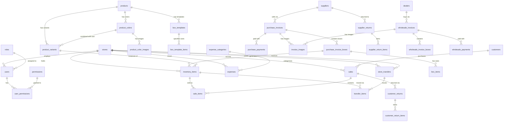

# Multi-Store Shoe Retail ERP System — Implementation Plan

## Overview

A web-based ERP for managing a multi-store shoe retail chain. The platform tracks the full business lifecycle: purchasing shoes from suppliers in boxes → storing them in inventory → distributing to stores → selling via POS → handling returns, expenses, and wholesale, all with role-based access control across unlimited stores.

**Tech Stack:** React + Vite (frontend) · Node.js + Express (backend) · PostgreSQL (database) · Local file storage now, S3-ready abstraction for later deployment

> [!NOTE]
> Storage is designed with an abstraction layer — a `StorageService` interface that initially writes to disk (`/uploads/`) and can be swapped to AWS S3 with a config change, zero code changes required.

---

## 1. Database Schema — Detailed Explanation

The database is the heart of this system. Every table is designed with a specific purpose, and every relationship tells a story about how the shoe business operates. Let me walk through each group of tables, explain **why** each column exists, and how tables connect to each other.

### 1.1 Stores

Stores are the top-level organizational unit. Everything — employees, inventory, sales, expenses — belongs to a store.

```sql
stores
├── id              UUID, primary key
├── name            VARCHAR(100)     -- "Main Warehouse", "Store A", etc.
├── address         TEXT             -- Physical location
├── phone           VARCHAR(20)
├── is_warehouse    BOOLEAN          -- TRUE = this is the main warehouse, not a retail store
├── is_active       BOOLEAN          -- Soft delete: deactivate instead of delete
├── created_at      TIMESTAMP
└── updated_at      TIMESTAMP
```

**Why `is_warehouse`?** The main warehouse is special — it receives bulk purchases from suppliers, then distributes to retail stores. We need to distinguish it from retail stores in inventory flow logic, transfer rules, and reporting. A store with `is_warehouse = true` won't appear in the POS sales page, for example.

**Why `is_active` instead of deleting?** You can never truly delete a store because historical sales, transfers, and expenses reference it. Deactivating it hides it from active lists while preserving all historical data.

---

### 1.2 Users, Roles & Permissions

The permission system has three layers: **Users → Roles → Individual Permissions**. Roles give a baseline, and individual permissions allow fine-tuning.

```sql
roles
├── id              SERIAL, primary key
├── name            VARCHAR(50)      -- 'admin', 'store_manager', 'employee'
├── description     TEXT
└── created_at      TIMESTAMP
```

```sql
users
├── id              UUID, primary key
├── username        VARCHAR(50), unique
├── email           VARCHAR(100), unique
├── password_hash   VARCHAR(255)     -- bcrypt hashed, NEVER plain text
├── full_name       VARCHAR(100)
├── role_id         FK → roles       -- Base role assignment
├── store_id        FK → stores      -- Which store they belong to (NULL for admin)
├── is_active       BOOLEAN
├── last_login_at   TIMESTAMP        -- Track when they last logged in
├── created_at      TIMESTAMP
└── updated_at      TIMESTAMP
```

**Why `store_id` is nullable?** An admin manages ALL stores, so they don't belong to one specific store. Regular employees and store managers always belong to exactly one store. The backend uses this to automatically filter data — an employee at Store A will only see Store A's inventory, sales, etc.

```sql
permissions
├── id              SERIAL, primary key
├── code            VARCHAR(50), unique   -- 'users', 'inventory', 'sales', etc.
├── description     TEXT
├── category        VARCHAR(50)           -- Grouping for UI display
└── created_at      TIMESTAMP
```

```sql
user_permissions
├── id              SERIAL, primary key
├── user_id         FK → users
├── permission_code FK → permissions(code)
├── access_level    ENUM('read','write')  -- 'read' = view only, 'write' = view + create/edit/delete
└── granted_at      TIMESTAMP

UNIQUE constraint on (user_id, permission_code)  -- One entry per user per permission
```

**How the dual-level permission system works:**

Every permission has two levels — **read** (view only) and **write** (view + create/edit/delete):
- A user with `inventory` at `read` level can see inventory lists, search products, view stock levels — but cannot add, edit, or change status of items.
- The same user with `inventory` at `write` level can do everything the read level allows PLUS create items, update statuses, etc.
- **Write always implies read.** If you have write access, you automatically have read access.

The middleware checks both the permission code AND the access level:
```
// Example: Creating a purchase invoice requires 'purchases' at 'write' level
router.post('/', auth, permission('purchases', 'write'), controller.create);

// Example: Viewing purchase list only requires 'purchases' at 'read' level
router.get('/', auth, permission('purchases', 'read'), controller.list);
```

**Permission codes** (seeded on first run):
| Code | Read Level (view only) | Write Level (view + edit) |
|---|---|---|
| `users` | View user list and profiles | Create/edit/deactivate users |
| `inventory` | View inventory, stock levels | Add/edit items, change status |
| `sales` | View sales history | Process sales via POS |
| `purchases` | View purchase invoices | Create invoices, record payments |
| `returns` | View returns history | Process customer/supplier returns |
| `transfers` | View transfer list | Create, ship, receive transfers |
| `expenses` | View expenses | Record and edit expenses |
| `reports` | View basic reports | Access all reports and export |
| `dealers` | View dealer list | Manage dealers and wholesale |
| `products` | View product catalog | Create/edit products, variants |
| `stores` | View store list | Create/edit stores |
| `all_stores` | View data from all stores | Manage data across all stores |

```sql
refresh_tokens
├── id              UUID, primary key
├── user_id         FK → users
├── token           VARCHAR(500)     -- The actual refresh token string
├── expires_at      TIMESTAMP        -- Auto-expire after X days
├── is_revoked      BOOLEAN          -- Manual revocation on logout
└── created_at      TIMESTAMP
```

**Why refresh tokens in the database?** JWT access tokens are short-lived (15 min). When they expire, the frontend uses the refresh token to get a new one without re-logging in. Storing refresh tokens in the DB allows us to revoke them on logout or when we detect suspicious activity.

---

### 1.3 Products, Colors, Images & Variants

This is the product catalog. The key insight is that a "product" is NOT a specific shoe — it's a *model line*. The actual purchasable items are **variants** (a specific product + color + size combination).

```
Product Hierarchy:
  Product (Nike Air Max 90)
    └── Color (Black)
    │     └── Images (front.jpg, side.jpg)
    │     └── Variant: Size 40  → SKU: NAM90-BLK-40
    │     └── Variant: Size 41  → SKU: NAM90-BLK-41
    │     └── Variant: Size 42  → SKU: NAM90-BLK-42
    └── Color (White)
          └── Images (front.jpg)
          └── Variant: Size 40  → SKU: NAM90-WHT-40
          └── Variant: Size 42  → SKU: NAM90-WHT-42
```

```sql
products
├── id                    UUID, primary key
├── product_code          VARCHAR(50), unique   -- "NAM90", human-readable identifier
├── brand                 VARCHAR(100)          -- "Nike"
├── model_name            VARCHAR(200)          -- "Air Max 90"
├── net_price             DECIMAL(10,2)         -- Reference cost (what it generally costs to buy)
├── default_selling_price DECIMAL(10,2)         -- Default retail price (used when no store override)
├── min_selling_price     DECIMAL(10,2)         -- Default floor price
├── max_selling_price     DECIMAL(10,2)         -- Default ceiling price
├── description           TEXT                  -- Optional notes
├── is_active             BOOLEAN
├── created_at            TIMESTAMP
└── updated_at            TIMESTAMP
```

**Why separate `net_price` from actual cost?** The `net_price` is a general reference — "this shoe typically costs us 800 EGP." But the *actual* cost changes per purchase. When you buy Box A from Supplier X at 750/shoe and Box B from Supplier Y at 820/shoe, each inventory item stores its own cost. `net_price` is just for reference and quick estimates.

**Why min/max selling price on the product?** These are the **default** prices. Employees can sell within this range. BUT these can be overridden per store (see `store_product_prices` below).

```sql
store_product_prices
├── id                    UUID, primary key
├── store_id              FK → stores
├── product_id            FK → products
├── selling_price         DECIMAL(10,2)         -- Override selling price for this store
├── min_selling_price     DECIMAL(10,2)         -- Override min price (nullable = use product default)
├── max_selling_price     DECIMAL(10,2)         -- Override max price (nullable = use product default)
├── created_at            TIMESTAMP
└── updated_at            TIMESTAMP

UNIQUE constraint on (store_id, product_id)  -- One override per product per store
```

**Per-store pricing overrides:** The same product can have different prices at different stores. For example:
- Product "Nike Air Max" has a default price of 1500 EGP
- Store A (downtown, premium location) sells it at 1700 EGP
- Store B (outlet) sells it at 1300 EGP

**How pricing resolution works at POS:**
1. System checks `store_product_prices` for an override for this product + this store
2. If an override exists → use the store's `selling_price`, `min_selling_price`, `max_selling_price`
3. If no override exists → fall back to the product's `default_selling_price`, `min_selling_price`, `max_selling_price`
4. If the store override has `min_selling_price` or `max_selling_price` as NULL → fall back to the product's default for that specific field

This gives maximum flexibility: set a global default, then customize per store where needed.

```sql
product_colors
├── id              UUID, primary key
├── product_id      FK → products
├── color_name      VARCHAR(50)      -- "Black", "White/Red", "Navy Blue"
├── hex_code        VARCHAR(7)       -- "#000000" (optional, for UI color swatches)
├── is_active       BOOLEAN
└── created_at      TIMESTAMP

UNIQUE constraint on (product_id, color_name)
```

```sql
product_color_images
├── id                UUID, primary key
├── product_color_id  FK → product_colors
├── image_url         TEXT            -- "/uploads/products/nam90-black-1.jpg" (local now, S3 URL later)
├── is_primary        BOOLEAN         -- Which image to show as thumbnail
├── sort_order        INTEGER         -- Display ordering
└── created_at        TIMESTAMP
```

**Why images are per-color, not per-product?** A Nike Air Max 90 in black looks completely different from one in white. Customers and employees need to see the actual shoe they're buying/selling. Each color can have multiple images (front, side, back).

```sql
product_variants
├── id                UUID, primary key
├── product_id        FK → products
├── product_color_id  FK → product_colors
├── size_eu           VARCHAR(10)    -- "42", "41.5" (European standard — primary size)
├── size_us           VARCHAR(10)    -- "9", "8.5" (US sizing, nullable)
├── size_uk           VARCHAR(10)    -- "8", "7.5" (UK sizing, nullable)
├── size_cm           DECIMAL(4,1)   -- 27.0 (centimeters — foot length, nullable)
├── sku               VARCHAR(50), unique, auto-generated  -- "NAM90-BLK-42"
├── is_active         BOOLEAN
└── created_at        TIMESTAMP

UNIQUE constraint on (product_id, product_color_id, size_eu)
```

**Multi-format shoe sizing:** Sizes are stored in **all four formats** — EU, US, UK, and centimeters. The EU size (`size_eu`) is the primary/required field used for uniqueness, display, and search. US, UK, and cm sizes are optional but tracked when available. This is important because:
- Different brands use different sizing standards
- Customers may ask "do you have this in a US 9?" or "what's that in cm?" — the system can search across all formats
- `size_cm` stores the actual foot length in centimeters (e.g., 27.0 cm = EU 42) — useful for precise fitting
- When entering sizes, the system can auto-suggest equivalents based on a conversion table

**Why VARCHAR for EU/US/UK but DECIMAL for cm?** EU/US/UK sizes can be half-sizes like "41.5" which are labels, not measurements. CM is an actual measurement, so DECIMAL(4,1) is appropriate (e.g., 27.0, 28.5).

**What is the `sku`?** Stock Keeping Unit — a unique identifier for every variant. Auto-generated from product code + color abbreviation + EU size. This is what employees type into the POS, and what future barcode labels will encode.

---

### 1.4 Box Templates

When purchasing from suppliers, shoes come in boxes with a standard size distribution. Box templates save time — instead of manually entering "size 40: 1, size 41: 1, size 42: 2, ..." every time, you define it once and reuse it.

```sql
box_templates
├── id              UUID, primary key
├── name            VARCHAR(100)    -- "Standard Nike Box", "Adidas Large Box"
├── product_id      FK → products   -- Which product this template is for
├── notes           TEXT
├── created_at      TIMESTAMP
└── updated_at      TIMESTAMP
```

```sql
box_template_items
├── id              SERIAL, primary key
├── template_id     FK → box_templates
├── size            VARCHAR(10)    -- "40", "41", etc.
├── quantity         INTEGER        -- How many of this size in the standard box
└── created_at      TIMESTAMP
```

**Example:** A "Standard Nike Air Max Box" template might contain:
| Size | Quantity |
|---|---|
| 40 | 1 |
| 41 | 1 |
| 42 | 2 |
| 43 | 2 |
| 44 | 2 |
| **Total** | **8 shoes** |

When creating a purchase invoice, the user can: (1) enter sizes manually, (2) pick a template as-is, or (3) pick a template and modify it (e.g., add an extra size 43).

---

### 1.5 Suppliers & Purchase Invoices

This is how products enter the system. The flow is flexible:

```
Typical flow:      Supplier → Purchase Invoice → Boxes (details later) → Inventory Items
Direct delivery:   Supplier → Invoice → Box delivered to Store → Details added at store
Sold before store: Supplier → Invoice → Box sold to Dealer (details optional)
Legacy stock:      Manual inventory entry (no invoice, no supplier)
```

```sql
suppliers
├── id              UUID, primary key
├── name            VARCHAR(200)
├── phone           VARCHAR(20)
├── email           VARCHAR(100)
├── address         TEXT
├── notes           TEXT
├── is_active       BOOLEAN
└── created_at      TIMESTAMP
```

```sql
purchase_invoices
├── id              UUID, primary key
├── invoice_number  VARCHAR(50), unique  -- "PI-2026-0001" (auto-generated)
├── supplier_id     FK → suppliers
├── total_amount    DECIMAL(12,2)        -- Grand total of the invoice
├── paid_amount     DECIMAL(12,2)        -- Computed: sum of payments allocated to this invoice
├── status          ENUM('pending','partial','paid')  -- Derived from paid vs total
├── notes           TEXT
├── invoice_date    DATE                 -- When the purchase happened
├── created_by      FK → users           -- Who created this invoice
├── created_at      TIMESTAMP
└── updated_at      TIMESTAMP
```

**Why `paid_amount` alongside `total_amount`?** Supplier payments are often not immediate. You might buy 10 boxes for 50,000 EGP, pay 20,000 now, and owe 30,000. The `status` is derived: if `paid_amount = 0` → pending, if `0 < paid_amount < total_amount` → partial, if `paid_amount >= total_amount` → paid.

> [!IMPORTANT]
> **Supplier-level payment auto-assignment (FIFO):** Payments are made to a **supplier**, not to a specific invoice. When you pay a supplier 30,000 EGP, the system automatically distributes that payment across the supplier's outstanding invoices in chronological order (oldest first). Example:
> - Invoice PI-001: owes 15,000 → fully paid by this payment (15,000 allocated)
> - Invoice PI-002: owes 25,000 → partially paid (remaining 15,000 allocated)
>
> This matches how real-world supplier relationships work — you pay the supplier a lump sum and they credit your oldest debts first.

```sql
supplier_payments
├── id              UUID, primary key
├── supplier_id     FK → suppliers       -- Payment is to the SUPPLIER, not to a specific invoice
├── total_amount    DECIMAL(10,2)        -- Total amount paid in this transaction
├── payment_method  VARCHAR(50)          -- "cash", "bank_transfer", "instapay", "vodafone_cash"
├── payment_date    DATE
├── reference_no    VARCHAR(100)         -- Transaction reference for wire transfers
├── notes           TEXT
├── created_by      FK → users
└── created_at      TIMESTAMP
```

```sql
supplier_payment_allocations
├── id              UUID, primary key
├── payment_id      FK → supplier_payments
├── invoice_id      FK → purchase_invoices
├── allocated_amount DECIMAL(10,2)       -- How much of this payment went to this invoice
└── created_at      TIMESTAMP
```

**How payment allocation works:**
1. User records a payment of 30,000 EGP to Supplier X
2. System fetches all unpaid/partial invoices for Supplier X, ordered by `invoice_date ASC` (oldest first)
3. System allocates the 30,000 across invoices until the payment is fully distributed
4. Each `supplier_payment_allocations` row records how much went to which invoice
5. Each invoice's `paid_amount` is recalculated as the sum of its allocations
6. Invoice `status` is updated accordingly

**Supplier PDF Statements:** The system can generate a PDF statement for any supplier showing:
- All purchase invoices (amounts, dates)
- All payments received (amounts, dates, methods)
- All supplier returns (refunded amounts)
- Running balance (total owed → payments → returns → current debt)
- Generated via a `/api/suppliers/:id/statement` endpoint

```sql
purchase_invoice_boxes
├── id                  UUID, primary key
├── invoice_id          FK → purchase_invoices
├── product_id          FK → products (nullable)       -- NULL if not yet known
├── product_color_id    FK → product_colors (nullable)  -- NULL if not yet known
├── box_template_id     FK → box_templates (nullable)
├── cost_per_item       DECIMAL(10,2)    -- Actual cost per shoe in THIS box
├── total_items         INTEGER          -- Known: how many shoes in the box (even if sizes unknown)
├── destination_store_id FK → stores (nullable)  -- NULL if not yet assigned
├── detail_status       ENUM('pending','partial','complete')  -- Are sizes/colors filled in?
├── notes               TEXT
├── created_at          TIMESTAMP
└── updated_at          TIMESTAMP
```

**Deferred box details — this is a critical workflow change.** In the real world, you often know:
- "I bought 5 boxes from Supplier X for 40,000 EGP total, 8 shoes per box at 1,000 each"
- But you DON'T yet know the exact colors, sizes, or which store each box goes to

The box is created with `product_id`, `product_color_id`, and `destination_store_id` as **nullable**. The `detail_status` tracks:
- `pending` — box was logged on the invoice but no details filled in yet
- `partial` — some details filled (e.g., product is known but sizes aren't)
- `complete` — all details are filled in, inventory items have been generated

Box details are typically completed when:
1. The box is **delivered to a store** — the store employee opens it, counts the sizes, and enters the details
2. The box is **sold to a dealer** — details may or may not be entered (optional for wholesale)

**Inventory items are only created when `detail_status` = `complete`.** This prevents creating phantom inventory from boxes we haven't opened yet.

```sql
box_items
├── id              SERIAL, primary key
├── invoice_box_id  FK → purchase_invoice_boxes
├── size_eu         VARCHAR(10)    -- "42" (matches product_variants.size_eu)
├── size_us         VARCHAR(10)    -- "9" (optional)
├── size_uk         VARCHAR(10)    -- "8" (optional)
├── size_cm         DECIMAL(4,1)   -- 27.0 (optional)
├── quantity        INTEGER        -- 2 (means 2 shoes of this size in this box)
└── created_at      TIMESTAMP
```

**When box details are completed and the box is marked `complete`:** For each box_item with quantity 2 and size_eu "42", the system creates 2 rows in `inventory_items`, each representing one physical shoe, with the cost from `cost_per_item` and the store from `destination_store_id`.

```sql
attached_images
├── id              UUID, primary key
├── entity_type     VARCHAR(30)     -- 'purchase_invoice', 'wholesale_invoice',
│                                   -- 'supplier_payment', 'dealer_payment', 'sale_payment'
├── entity_id       UUID            -- FK to the relevant record
├── image_url       TEXT            -- File path (local now, S3 URL later)
├── original_name   VARCHAR(255)    -- Original uploaded filename
└── created_at      TIMESTAMP

INDEX on (entity_type, entity_id)
```

**General-purpose image attachment table.** This polymorphic table stores images for any entity in the system:
- **`purchase_invoice`** — scanned supplier invoice documents
- **`wholesale_invoice`** — scanned dealer invoice documents
- **`supplier_payment`** — proof of wire transfer to supplier (InstaPay screenshot, Vodafone Cash receipt, etc.)
- **`dealer_payment`** — proof of payment received from dealer
- **`sale_payment`** — proof of wire transfer from customer (InstaPay screenshot, etc.)

**Why attach images to payments?** When a customer pays 1300 EGP via InstaPay, the employee takes a screenshot of the transfer confirmation. This screenshot is attached to the `sale_payment` record as proof. Same for supplier/dealer wire transfers — you keep the receipt photo as evidence.

---

### 1.6 Inventory

**This is the most important table in the system.** Every physical shoe in your business is one row here. When you buy a box of 8 shoes, 8 rows are created. When one is sold, its status changes to `sold`. This is how we track every shoe from purchase to sale.

```sql
inventory_items
├── id              UUID, primary key
├── variant_id      FK → product_variants  -- Which shoe (product + color + size)
├── store_id        FK → stores            -- Current location
├── cost            DECIMAL(10,2)          -- What we paid for THIS specific shoe
├── invoice_box_id  FK → purchase_invoice_boxes (nullable)  -- NULL for legacy/manual stock
├── source          ENUM('purchase','manual')  -- How it entered the system
├── status          ENUM('in_stock','sold','returned','damaged','in_transfer')
├── barcode         VARCHAR(100)           -- Future: physical barcode label
├── sold_at         TIMESTAMP              -- When it was sold (NULL if not sold)
├── notes           TEXT                   -- For manual entries: "existing stock before system"
├── created_at      TIMESTAMP
└── updated_at      TIMESTAMP

INDEX on (store_id, status)        -- Fast: "show me all in-stock items at Store A"
INDEX on (variant_id, store_id)    -- Fast: "how many Air Max Black 42 at Store A?"
```

**Why one row per physical shoe, not aggregated counts?** Because each shoe has its own cost (different boxes → different prices), its own history (when purchased, transferred, sold), and its own status. If you tracked only counts, you couldn't calculate accurate per-item profit or trace a specific shoe's journey.

**The `cost` column is crucial for profit calculation.** When shoe #1234 is sold for 1500 EGP and its `cost` was 800 EGP, the profit on that item is 700 EGP. The cost was inherited from `purchase_invoice_boxes.cost_per_item` when the inventory item was created.

**Legacy / manual stock (`source` = `manual`):** Stores that existed before the system was built will have shoes on shelves with no purchase invoice. These are added manually:
- Employee creates inventory items directly, selecting the product variant, store, and entering a cost estimate
- `invoice_box_id` is NULL (no purchase record)
- `source` = `manual` distinguishes these from purchase-generated items
- The system otherwise treats them identically — they can be sold, transferred, returned, etc.
- This also handles donations, samples, or any other stock that enters without a supplier invoice

**Status lifecycle:**
```
Created (from purchase or manual) → in_stock
in_stock → sold (via POS sale)
in_stock → in_transfer (transfer created)
in_transfer → in_stock (transfer received, store_id changes)
sold → returned (customer return, status goes back to in_stock)
in_stock → damaged (manual status change)
```

---

### 1.7 Store Transfers

Moving shoes between stores. Example: Main Warehouse sends 50 shoes to Store A.

```sql
store_transfers
├── id              UUID, primary key
├── transfer_number VARCHAR(50), unique  -- "TR-2026-0001"
├── from_store_id   FK → stores
├── to_store_id     FK → stores
├── status          ENUM('pending','shipped','received','cancelled')
├── notes           TEXT
├── created_by      FK → users
├── shipped_at      TIMESTAMP    -- When marked as shipped
├── received_at     TIMESTAMP    -- When marked as received
├── created_at      TIMESTAMP
└── updated_at      TIMESTAMP
```

```sql
transfer_items
├── id                UUID, primary key
├── transfer_id       FK → store_transfers
├── inventory_item_id FK → inventory_items   -- The specific shoe being moved
└── created_at        TIMESTAMP
```

**Transfer workflow:**
1. **Create** (status = `pending`): Select items from the source store. Items' status changes to `in_transfer` — they can't be sold while being moved.
2. **Ship** (status = `shipped`): Physically packed and sent. Timestamp recorded.
3. **Receive** (status = `received`): Destination store confirms arrival. Each item's `store_id` updates to the destination store, and status goes back to `in_stock`.
4. **Cancel** (status = `cancelled`): If cancelled, items' status reverts to `in_stock` at the original store.

---

### 1.8 Customers

Minimal customer tracking. Used for returns (to look up original sale) and purchase history.

```sql
customers
├── id              UUID, primary key
├── phone           VARCHAR(20), unique   -- Primary identifier (how you find a customer)
├── name            VARCHAR(100)
├── notes           TEXT
├── created_at      TIMESTAMP
└── updated_at      TIMESTAMP
```

**Why `phone` as unique?** In retail, customers are often identified by phone number. "I bought shoes here last week, my number is 01xx..." — the employee searches by phone, finds the customer, sees their purchase history.

---

### 1.9 Sales (POS)

The point-of-sale system. Each sale is a cart checkout — one or more shoes sold to a customer in one transaction.

```sql
sales
├── id              UUID, primary key
├── sale_number     VARCHAR(50), unique  -- "S-2026-0001"
├── store_id        FK → stores          -- Which store made this sale
├── customer_id     FK → customers       -- Nullable: walk-in customers
├── total_amount    DECIMAL(10,2)        -- Sum of all item sale prices
├── discount_amount DECIMAL(10,2)        -- Overall discount if any
├── final_amount    DECIMAL(10,2)        -- total - discount = what was actually collected
├── notes           TEXT
├── created_by      FK → users           -- Which employee processed the sale
├── created_at      TIMESTAMP            -- Sale timestamp (receipt date/time)
```

```sql
sale_payments
├── id              UUID, primary key
├── sale_id         FK → sales
├── payment_method  ENUM('cash','card','instapay','vodafone_cash','fawry','bank_transfer','other')
├── amount          DECIMAL(10,2)        -- Amount paid via this method
├── reference_no    VARCHAR(100)         -- Transaction/transfer reference (for wire transfers)
├── notes           TEXT
└── created_at      TIMESTAMP
```

**Why a separate `sale_payments` table instead of a single `payment_method` column?** Because a customer may pay with **multiple methods in one sale** — e.g., 1500 cash + 1300 via InstaPay. Each payment method gets its own row with its amount and reference number.

**Supported payment methods:**
| Method | Description |
|---|---|
| `cash` | Physical cash |
| `card` | Credit/debit card |
| `instapay` | InstaPay bank transfer |
| `vodafone_cash` | Vodafone Cash mobile wallet |
| `fawry` | Fawry payment |
| `bank_transfer` | Traditional bank wire |
| `other` | Any other method (described in notes) |

For wire transfers (`instapay`, `vodafone_cash`, `bank_transfer`), the `reference_no` stores the transaction ID for verification. The system validates that the sum of all `sale_payments` for a sale equals the `final_amount`.

```sql
sale_items
├── id                UUID, primary key
├── sale_id           FK → sales
├── inventory_item_id FK → inventory_items  -- The SPECIFIC shoe sold
├── sale_price        DECIMAL(10,2)         -- What the customer paid for this shoe
├── cost_at_sale      DECIMAL(10,2)         -- Snapshot of the shoe's cost at time of sale
├── created_at        TIMESTAMP
```

**Why `cost_at_sale` in sale_items?** This is a snapshot. The inventory item's `cost` could theoretically be recalculated later (though unlikely). By recording `cost_at_sale` at the moment of sale, we preserve an immutable record for profit calculation: **profit = sale_price − cost_at_sale**.

**Why `inventory_item_id` instead of `variant_id`?** Because we need to know WHICH SPECIFIC shoe was sold. Two shoes of the same variant (Air Max / Black / 42) might have different costs if they came from different purchase boxes. Linking to the specific inventory item gives us exact cost, exact profit, and the ability to trace every shoe's lifecycle.

---

### 1.10 Returns

Two completely separate flows: customers returning shoes, and returning shoes to suppliers.

```sql
customer_returns
├── id              UUID, primary key
├── return_number   VARCHAR(50), unique  -- "CR-2026-0001"
├── sale_id         FK → sales           -- Original sale being (partially) returned
├── store_id        FK → stores
├── reason          TEXT
├── notes           TEXT
├── created_by      FK → users
└── created_at      TIMESTAMP
```

```sql
customer_return_items
├── id              SERIAL, primary key
├── return_id       FK → customer_returns
├── sale_item_id    FK → sale_items      -- Which sale item is being returned
├── refund_amount   DECIMAL(10,2)        -- Must equal the sale_item's sale_price
└── created_at      TIMESTAMP
```

**Why `refund_amount` must equal the original `sale_price`?** Business rule: customer refunds are always at the original price paid. The system enforces this — the return form auto-fills the refund amount from the sale_item's price, and the backend validates it.

**What happens on return?**
1. A `customer_return` record is created, referencing the original sale
2. For each returned shoe: the `inventory_item`'s status changes from `sold` back to `in_stock` (or `returned` if you want to track returned items separately)
3. The refund amount is recorded

```sql
supplier_returns
├── id                  UUID, primary key
├── return_number       VARCHAR(50), unique
├── supplier_id         FK → suppliers
├── purchase_invoice_id FK → purchase_invoices (nullable)
├── reason              TEXT
├── notes               TEXT
├── total_amount        DECIMAL(10,2)    -- Total value of returned items
├── created_by          FK → users
└── created_at          TIMESTAMP
```

```sql
supplier_return_items
├── id                UUID, primary key
├── return_id         FK → supplier_returns
├── inventory_item_id FK → inventory_items
└── created_at        TIMESTAMP
```

Supplier returns can be entire boxes or individual items. The inventory items are marked as `returned` and removed from active stock.

---

### 1.11 Wholesale Dealers

When the business sells boxes to wholesale dealers (B2B), not individual shoes to consumers.

```sql
dealers
├── id              UUID, primary key
├── name            VARCHAR(200)
├── phone           VARCHAR(20)
├── email           VARCHAR(100)
├── address         TEXT
├── notes           TEXT
├── is_active       BOOLEAN
└── created_at      TIMESTAMP
```

```sql
wholesale_invoices
├── id              UUID, primary key
├── invoice_number  VARCHAR(50), unique  -- "WI-2026-0001"
├── dealer_id       FK → dealers
├── total_amount    DECIMAL(12,2)
├── paid_amount     DECIMAL(12,2)
├── status          ENUM('pending','partial','paid')
├── notes           TEXT
├── invoice_date    DATE
├── created_by      FK → users
├── created_at      TIMESTAMP
└── updated_at      TIMESTAMP
```

```sql
wholesale_invoice_boxes
├── id                UUID, primary key
├── invoice_id        FK → wholesale_invoices
├── product_id        FK → products
├── product_color_id  FK → product_colors
├── size_quantities   JSONB              -- { "40": 1, "41": 2, "42": 3 }
├── price_per_item    DECIMAL(10,2)
├── total_items       INTEGER
├── total_price       DECIMAL(10,2)      -- price_per_item × total_items
└── created_at        TIMESTAMP
```

**Why JSONB for `size_quantities`?** Wholesale boxes have flexible size distributions. JSONB is perfect — it stores the size breakdown as a JSON object, is queryable in PostgreSQL, and avoids needing a child table for what is display-only data.

```sql
dealer_payments
├── id              UUID, primary key
├── dealer_id       FK → dealers             -- Payment is to the DEALER, not a specific invoice
├── total_amount    DECIMAL(10,2)
├── payment_method  VARCHAR(50)              -- "cash", "bank_transfer", "instapay", etc.
├── payment_date    DATE
├── reference_no    VARCHAR(100)             -- Transaction reference for wire transfers
├── notes           TEXT
├── created_by      FK → users
└── created_at      TIMESTAMP
```

```sql
dealer_payment_allocations
├── id              UUID, primary key
├── payment_id      FK → dealer_payments
├── invoice_id      FK → wholesale_invoices
├── allocated_amount DECIMAL(10,2)
└── created_at      TIMESTAMP
```

Same FIFO auto-assignment pattern as supplier payments — dealer payments are distributed across outstanding wholesale invoices oldest-first. Dealers may pay in full, partial, or installments. PDF statements are also available per dealer.

---

### 1.12 Expenses

Every store has running costs.

```sql
expense_categories
├── id              SERIAL, primary key
├── name            VARCHAR(100), unique  -- "Rent", "Salaries", "Maintenance", "Other"
└── created_at      TIMESTAMP
```

```sql
expenses
├── id              UUID, primary key
├── store_id        FK → stores
├── category_id     FK → expense_categories
├── amount          DECIMAL(10,2)
├── description     TEXT             -- "March rent", "Electrician repair"
├── expense_date    DATE
├── created_by      FK → users
├── created_at      TIMESTAMP
└── updated_at      TIMESTAMP
```

Expenses are per store. Reports will sum these up for store-level and business-level P&L calculations.

---

### 1.13 Audit Logs (Future-Proof)

```sql
audit_logs
├── id              UUID, primary key
├── user_id         FK → users
├── action          VARCHAR(50)      -- "CREATE", "UPDATE", "DELETE"
├── entity_type     VARCHAR(50)      -- "sale", "inventory_item", "purchase_invoice"
├── entity_id       UUID
├── old_data        JSONB            -- Previous state (for updates)
├── new_data        JSONB            -- New state
├── ip_address      VARCHAR(45)
└── created_at      TIMESTAMP

INDEX on (entity_type, entity_id)
INDEX on (user_id, created_at)
```

Records all meaningful actions. Essential for accountability in a multi-user business system.

---

### Complete Entity-Relationship Diagram



---

## 2. Backend Architecture

### Module Structure (Domain-Driven)

```
backend/
├── src/
│   ├── config/            # Database, env vars, storage config
│   ├── middleware/         # auth, permissions, validation, error handling, uploads
│   ├── modules/           # One folder per business domain
│   │   ├── auth/          # Login, JWT, refresh tokens
│   │   ├── users/         # User CRUD, permission management
│   │   ├── stores/        # Store CRUD
│   │   ├── products/      # Products, colors, images, variants
│   │   ├── box-templates/ # Box template CRUD
│   │   ├── suppliers/     # Supplier CRUD
│   │   ├── purchases/     # Purchase invoices, boxes → inventory creation
│   │   ├── inventory/     # Inventory queries, status updates, stock levels
│   │   ├── transfers/     # Store-to-store transfers with workflow
│   │   ├── customers/     # Customer CRUD
│   │   ├── sales/         # POS: cart-to-sale, price validation
│   │   ├── returns/       # Customer returns, supplier returns
│   │   ├── dealers/       # Dealer CRUD
│   │   ├── wholesale/     # Wholesale invoices + payments
│   │   ├── expenses/      # Expense tracking + categories
│   │   └── reports/       # Aggregated queries for dashboards
│   ├── services/          # Shared services (StorageService, AuditService)
│   ├── db/migrations/     # Knex migration files
│   ├── db/seeds/          # Seed data
│   └── utils/             # AppError, pagination, code generators
├── uploads/               # Local file storage (dev/staging)
├── knexfile.js
└── .env
```

Each module follows the pattern: `routes.js → controller.js → service.js → database (via Knex)`

### Key Design Decisions

| Decision | Rationale |
|---|---|
| **Knex.js** (not Sequelize/Prisma) | Lightweight query builder with excellent migration support. Gives full SQL control without ORM magic. |
| **JWT (access + refresh)** | Stateless auth. 15-min access tokens + 7-day refresh tokens. |
| **Joi validation** | Validates every request body/params before reaching the controller. |
| **StorageService abstraction** | `LocalStorageService` now, `S3StorageService` later. Same interface. |
| **UUIDs for primary keys** | No auto-increment collisions across distributed systems. Harder to guess. |

---

## 3. REST API Endpoints

> Full list of ~80 endpoints organized by domain. See Section 3 in the previous version — unchanged. Key groups: Auth (4), Users (6), Stores (4), Products (12), Box Templates (5), Suppliers (4), Purchases (6), Inventory (5), Transfers (6), Customers (4), Sales (5), Returns (4), Dealers (4), Wholesale (5), Expenses (6), Reports (9).

---

## 4. Frontend Page Structure

### Technology

- **Vite + React** (fast dev server, HMR)
- **React Router v6** (client-side routing)
- **Axios** (API calls with JWT interceptor)
- **Recharts** (charts for reports)
- **React Hot Toast** (notifications)
- **React Icons** (icon library)
- **Vanilla CSS** with CSS custom properties (design system)

### Pages

| Page | Route | Key Features |
|---|---|---|
| Login | `/login` | Auth form, JWT storage |
| Dashboard | `/` | KPIs, charts, alerts, quick actions |
| **POS** | `/pos` | Product search, cart, price validation, checkout |
| Products | `/products` | Searchable table, filters |
| Product Detail | `/products/:id` | Colors, images, variants, pricing |
| Inventory | `/inventory` | Filter by store/product/status, stock levels |
| Purchases | `/purchases` | Invoice list, debt status |
| Purchase Create | `/purchases/new` | Multi-box form with template support |
| Transfers | `/transfers` | List with status workflow buttons |
| Customers | `/customers` | Phone search, purchase history |
| Returns | `/returns` | Customer + supplier return tabs |
| Suppliers | `/suppliers` | List with debt overview |
| Dealers | `/dealers` | List with debt overview |
| Wholesale | `/wholesale` | Invoice list + create |
| Expenses | `/expenses` | Category filter, monthly totals |
| Reports | `/reports/*` | Sub-pages for each report type |
| Stores | `/stores` | CRUD for store locations |
| Users | `/users` | User management + permission matrix |

---

## 5. Development Roadmap — 9 Phases

| Phase | Focus | Scope |
|---|---|---|
| **1** | Foundation | Project setup, DB migrations, auth, stores, users, frontend shell |
| **2** | Product Catalog | Products, colors, images, variants, box templates |
| **3** | Procurement | Suppliers, purchase invoices, auto inventory creation |
| **4** | Distribution | Store transfers with workflow |
| **5** | Sales & POS | Customers, POS page, price validation |
| **6** | Returns | Customer returns, supplier returns |
| **7** | Wholesale | Dealers, wholesale invoices, payments |
| **8** | Finance | Expenses, all reports, dashboard charts |
| **9** | Polish | Audit logs, responsive design, error states, testing |

> [!IMPORTANT]
> We build and verify one phase at a time. Each phase is independently testable. After Phase 1 is approved, we move to Phase 2, and so on.

---

## Verification Plan

### Per-Phase Testing
- **Database**: Run migrations, verify all tables and indexes created
- **API**: Test each endpoint via browser tool (create → read → update → list)
- **Frontend**: Navigate each page, verify forms, data flow, permissions

### End-to-End Scenario
Complete business flow test: create supplier → create purchase invoice with boxes → verify inventory items appear → transfer to store → sell via POS → process return → verify profit report.
